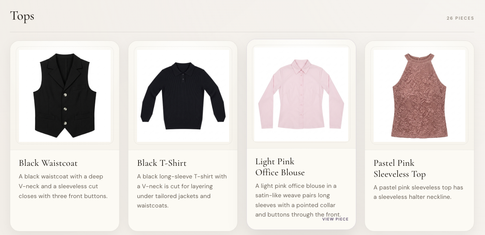
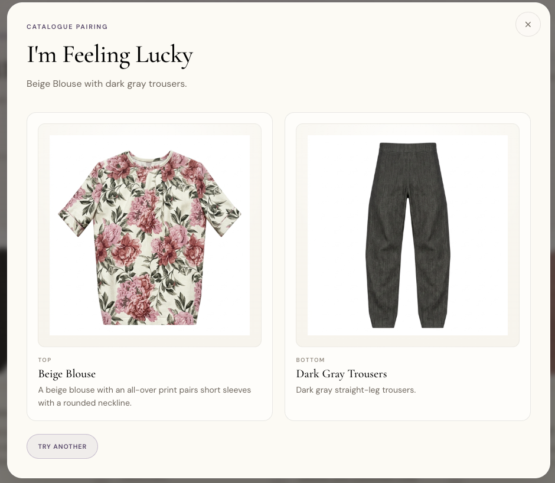

# Cloth Store

Private AI-assisted digital wardrobe with a production reconstruction pipeline and a static catalogue storefront.



## 1. Reconstruction pipeline

Turn mirror-selfie garment regions into clean, front-facing catalog images. See **[RECONSTRUCTION_PIPELINE.md](RECONSTRUCTION_PIPELINE.md)** for the full flow: VLM bbox → SAM cutouts → structured attributes → template selection → Gemini generation → `final_catalog/` packaging.

<details>
<summary>Run reconstruction pipeline</summary>

```bash
uv sync --group dev --group gemini

# Dry-run (validate + reuse plan, zero API calls)
uv run cloth-store-catalog-pipeline --fixture outfit_6 --role top --dry-run

# Package self-contained review bundle
uv run cloth-store-catalog-final-packaging --repo-root .

# Rebuild lexical index and garment identities
uv run cloth-store-catalog-identities validate --repo-root .
uv run cloth-store-catalog-identities rebuild --repo-root . --annotate-manifest
uv run cloth-store-catalog-exclusions --repo-root .
uv run cloth-store-catalog-index --repo-root .
```

Curation registries and rebuild workflow:
[`bench/catalog_generation/GARMENT_IDENTITIES.md`](bench/catalog_generation/GARMENT_IDENTITIES.md).

</details>

Primary outputs live under `bench/catalog_generation/outputs/nano_banana_2/catalog_production_v1/`; the frozen delivery bundle is `final_catalog/` (manifest, catalog.json, garment_identities.json, per-case assets, contact sheets). User-confirmed identity merges and role-level exclusions are declared in `bench/catalog_generation/garment_identities.json` and `catalog_exclusions.json` — see [`bench/catalog_generation/GARMENT_IDENTITIES.md`](bench/catalog_generation/GARMENT_IDENTITIES.md).

## 1b. Selfie crop and blur-only refocus (optional)

Portrait reframes for mirror selfies used in the storefront styling modal. Canonical method:
`blur_only_v2` with Qwen full-person recovery when SAM masks are torso-only or incomplete.

```bash
# Bench + package fixtures 1–31 (Apptainer wrapper runs SAM/VLM on GPU when needed)
bench/selfie_refocus/run.sh --from-fixture 1 --to-fixture 31

# Validate-only (no model run)
bench/selfie_refocus/run.sh --validate-only --from-fixture 1 --to-fixture 31
```

Deliverables: `bench/selfie_refocus/candidates/` (masks, overlays, comparison sheets) and
`final_selfies/` (manifest, per-fixture refocus + neck-down privacy crops, contact sheets).
All 31 current outfits display `crop_neck_down.jpg` in the storefront. See
`bench/selfie_refocus/README.md`.

## 2. Website (Cloth Store storefront)

Static editorial storefront served from `final_catalog/storefront.json` (derived from
catalog.json) plus 512px catalogue images and per-outfit neck-down styling selfies.
There is **no FastAPI app** in the current checkout — the live server is
`cloth-store-web` (stdlib HTTP on port **8080**).

**Selfie display policy:** valid neck-down privacy crops use
`final_selfies/outfit_N/crop_neck_down.jpg`; refocus fallbacks use
`crop_refocused.jpg` or `crop_only.jpg`; when no refocus deliverable exists the
resolver falls back to `data/outfit_N.jpeg`. Live URLs are under `/final_selfies/`;
the offline static bundle rewrites them to `assets/selfies/outfit_N/`.

<details>
<summary>Run the website</summary>

```bash
uv sync --group dev

# Build or refresh the static storefront payload
uv run cloth-store-web-build --repo-root .

# Serve locally (stdlib HTTP, correct CSS/JS MIME types)
uv run cloth-store-web --repo-root .

# Export a shareable offline bundle (directory + zip)
uv run cloth-store-static-bundle --repo-root . --validate
```

</details>

Open **http://127.0.0.1:8080/** — browse, search, top/dress/bottom filters, detail
modal with styling selfies, **Generate an Outfit**, and **I'm Feeling Lucky**.

### Screenshots

#### Browse the catalogue

The home view groups items into **Tops**, **Blazers**, **Dresses**, and **Bottoms**. Each card shows
a 512px product render, a short editorial description, and a **View Piece** link that
opens the detail modal (carousel, fashion advice, styling selfie when available).


#### I'm Feeling Lucky

Click the header action to draw a random catalogue-only look (top+bottom, blazer+top+bottom,
or blazer+dress) that was not photographed together. The modal labels each piece, shows
catalogue images only (no mirror-selfie hero), and offers **Try Another** to reshuffle
with recent-history diversity so key pieces and look types vary across clicks.



See **[docs/CLOTH_STORE.md](docs/CLOTH_STORE.md)** for the canonical storefront
guide and **[docs/static-bundle-guide.md](docs/static-bundle-guide.md)** for the
portable **`dist/lavani-closet.zip`** snapshot (extract, then double-click
`index.html`).

## Verify

<details>
<summary>Run validation</summary>

```bash
uv sync --group dev
uv run ruff format --check .
uv run ruff check .
uv run pytest --collect-only -q   # expect exactly 10 tests
uv run pytest
```

</details>

### Test suite policy

The repository caps automated tests at **exactly 10 scenario tests** (`tests/test_scenarios.py`). Each test consolidates related assertions across a major system boundary (static storefront/catalog contract, VLM bbox, SAM/cutouts, templates, Gemini credentials/requests/generation, production pipeline idempotency, texture/QC and derived geometry). Helpers live in `tests/helpers.py` (not collected by pytest).

## Upstream extraction (Apptainer)

Plan 1 localization bench for bbox/mask/cutout generation:

<details>
<summary>Run upstream extraction</summary>

```bash
export HF_HOME=/scratch4weeks/pg00807/huggingface
uv sync --group dev --group vlm --group sam
uv run cloth-store-bbox outfit_1.jpeg
./bench/plan1_localization/run.sh
```

</details>

See `bench/plan1_localization/README.md` and `bench/catalog_generation/README.md`.
