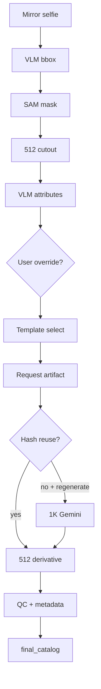

# Reconstruction pipeline overview

Turn a **mirror-selfie garment region** into a **clean, front-facing catalog image** suitable for a digital wardrobe. The production path is Plan 1 extraction → structured attributes → Gemini Nano Banana 2 generation → `final_catalog/` packaging.

## Goal

| Input | Output |
|-------|--------|
| Segmented 512×512 cutout from a mirror selfie (top, bottom, or dress) | Native **1K** catalog image + deterministic **512×512** derivative on white |

**Identity contract:** segmented cutout = color, material, texture, and visible details.  
**Geometry contract:** template (or derived geometry override) = silhouette and layout only — never color or fabric.

## High-level flow

1. **VLM bbox localization** — Qwen3.5-9B role-keyed boxes (`top` / `bottom` / `dress`) from the mirror selfie.
2. **SAM segmentation + catalog cutout** — SAM 3.1 masks inside padded crops; deterministic 512×512 RGB cutouts on opaque white.
3. **Structured VLM garment attributes** — Qwen extracts JSON fields from each cutout.
4. **User override precedence** — optional correction JSON overrides low-confidence VLM fields before prompt build.
5. **Template selection** — deterministic selector maps normalized attributes → template id; low confidence gates review.
6. **Deterministic Gemini request** — one request artifact binds: **Image 1** segmented cutout (identity), **Image 2** template (geometry), optional **Image 3** detail crop (tops).
7. **One native 1K generation** — model `gemini-3.1-flash-image`; local **512 LANCZOS** derivative written alongside.
8. **QC, hash-based reuse, packaging** — heuristic texture QC (non-blocking), exact-hash reuse or reference promotion, then `final_catalog/` bundle.



## Roles

| Role | Description |
|------|-------------|
| `top` | Shirts, blouses, blazers, waistcoats, sleeveless tops |
| `bottom` | Trousers, pants, skirts |
| `dress` | One-piece dresses (`outfit_27`, `outfit_29`, `outfit_30`) |

Dress items are indexed with role `dress` and appear in the storefront Dresses section.

## Input / output contracts

### Upstream (Plan 1 localization)

| Stage | CLI | Primary output path |
|-------|-----|---------------------|
| Bboxes | `cloth-store-bbox` | `bench/plan1_localization/outputs/{fixture}.json` |
| Masks | `cloth-store-masks` | `bench/plan1_localization/outputs/masks/{fixture}/{role}.png` |
| Cutouts | `cloth-store-cutouts` | `bench/plan1_localization/outputs/catalog_cutouts/{fixture}/catalog_{role}.png` |

Batch wrappers: `bench/plan1_localization/run.sh`, `run_masks.sh`, `run_cutouts.sh`.

### Catalog generation

| Asset | Path |
|-------|------|
| VLM attributes | `bench/catalog_generation/vlm_attributes/{fixture}_{role}.attributes.json` |
| User overrides | `bench/catalog_generation/overrides/{fixture}_{role}.override.json` |
| Request artifacts | `bench/catalog_generation/artifacts/{fixture}_{role}_{template_id}.*.request.json` |
| Templates | `bench/catalog_templates/generated/{template_id}.png` |
| Detail crops (tops) | `bench/catalog_generation/detail_crops/` |
| Case manifest | `bench/catalog_generation/manifest.json` |
| Garment identities | `bench/catalog_generation/garment_identities.json` |

### Production outputs (`catalog_production_v1`)

Namespace: `bench/catalog_generation/outputs/nano_banana_2/catalog_production_v1/{fixture}/`

| File | Role |
|------|------|
| `{role}_1k_raw.png` | Native 1K API output (canonical master) |
| `{role}.png` | Deterministic 512×512 LANCZOS derivative |
| `{role}.run.json` | Sanitized run metadata |

### Review bundle (`final_catalog/`)

Self-contained per-case copies: `outfit_N/{top|bottom|dress}/` with inputs, attributes, outputs, metadata. Repo-level `manifest.json`, `catalog.json`, `garment_identities.json`, and contact sheets under `final_catalog/contact_sheets/`.

## Identity dedup and aliases

Garment identity registry (`garment_identities.json`) maps observations to canonical garment IDs. Alias observations (e.g. shared trousers across fixtures) deduplicate to one indexed item. Rebuild:

```bash
uv run cloth-store-catalog-index --repo-root .
uv run cloth-store-catalog-identities --repo-root .
```

Lexical search: `uv run cloth-store-catalog-search "black blazer"`

## Prompt and precedence rules

```text
user correction  >  high-confidence VLM / source evidence  >  template (geometry only)
```

- **Segmented cutout (Image 1)** is authoritative for color, material, texture, pattern, embroidery, trim, buttons, seams.
- **Template (Image 2)** controls outer geometry and sleeve style only — never transfer template color or fabric.
- **Optional detail crop (Image 3)** reinforces source texture for tops.
- User override JSON can force geometry-reference mode (derived geometry from another fixture); see `bench/catalog_generation/README.md`.

## Safety and cost behavior

| Mode | Behavior |
|------|----------|
| `--dry-run` | Full validation, artifact build, reuse/promotion plan — **zero API calls** |
| Default (no flags) | Reuse production outputs when request artifact hashes match |
| `--regenerate` | Explicit opt-in for **one** billable 1K call |
| Automatic retries | **None** |

**Credentials:** `GEMINI_API_KEY` from environment or `GEMINI_CREDENTIALS_FILE`. Required only when a new generation is invoked.

Estimated image-output cost: **$0.067** per successful native 1K call.

## Primary CLIs

### Upstream extraction (Apptainer + local models)

```bash
export HF_HOME=/scratch4weeks/pg00807/huggingface
uv sync --group dev --group vlm --group sam

uv run cloth-store-bbox outfit_1.jpeg
./bench/plan1_localization/run.sh
./bench/plan1_localization/run_masks.sh
./bench/plan1_localization/run_cutouts.sh

uv run cloth-store-vlm-garment-attributes \
  bench/plan1_localization/outputs/catalog_cutouts/outfit_1/catalog_top.png \
  --fixture outfit_1 --role top \
  -o bench/catalog_generation/vlm_attributes/outfit_1_top.attributes.json
```

### Production catalog generation

```bash
uv sync --group dev --group gemini

uv run cloth-store-catalog-pipeline --fixture outfit_6 --role top --dry-run
uv run cloth-store-catalog-pipeline --fixture outfit_6 --role top
uv run cloth-store-catalog-pipeline --fixture outfit_6 --role top --regenerate
```

Optional flags: `--override`, `--vlm-attributes`, `--repo-root`, `--credentials-file`.

### Packaging and index

```bash
uv run cloth-store-catalog-final-packaging --repo-root .
uv run cloth-store-catalog-index --repo-root .
uv run cloth-store-web-build --repo-root .
```

## Range scripts

Batch regeneration for fixture ranges is documented in `bench/catalog_generation/README.md`. Always dry-run first; use `--regenerate` only for explicit billable calls.

## Selfie refocus

Optional blur-only background refocus stage for mirror selfies used in the storefront
styling modal. Canonical method: `blur_only_v2`.

### Flow

1. **Garment-union bbox** — derive person bounds from Plan1 localization with deterministic padding.
2. **SAM person mask** — segment reflected person inside padded crop.
3. **Quality validation** — detect torso-only masks, incomplete garment coverage, low vertical extent.
4. **Qwen full-person recovery** — when validation fails, localize full reflected person with Qwen3.5,
   merge bbox with garment union, re-segment with SAM (see `localize_full_reflected_person` in `vlm_bbox.py`).
5. **Aspect-safe portrait crop** — prefer 4:5, fallback 3:4 or source aspect; head in upper third.
6. **Blur-only refocus** — Gaussian blur on background only; person pixels and background color/brightness preserved.
7. **Review assessment** — metrics recommend `crop_refocused` or fallback `crop_only`.
8. **Packaging** — copy to `final_selfies/` with batched 4-outfit contact sheets.

### Commands

```bash
# Full range (bench + package)
bench/selfie_refocus/run.sh --from-fixture 1 --to-fixture 31

# Validate existing deliverables only
bench/selfie_refocus/run.sh --validate-only --from-fixture 1 --to-fixture 31

# Direct CLIs
uv run cloth-store-selfie-refocus --from-fixture 1 --to-fixture 31
uv run cloth-store-selfie-final-packaging --from-fixture 1 --to-fixture 31
uv run cloth-store-selfie-final-packaging --validate-only
```

| Location | Purpose |
|----------|---------|
| `bench/selfie_refocus/candidates/` | Bench workspace (masks, overlays, comparison sheets, recovery diagnostics) |
| `final_selfies/` | Self-contained review/delivery bundle (manifest, variants, contact sheets) |

Idempotent rerun skips fixtures whose `blur_only_v2` outputs match current source/localization hashes.
Fixtures marked `review_required: true` (e.g. outfit_14, outfit_29) should use `crop_only` until manually corrected.

See `bench/selfie_refocus/README.md` and `final_selfies/README.md`.

## Production outputs vs `final_catalog`

| | `catalog_production_v1` | `final_catalog/` | `bench/selfie_refocus/candidates` | `final_selfies/` |
|-|-------------------------|------------------|-----------------------------------|------------------|
| **Purpose** | Authoritative generation workspace and idempotent reuse store | Self-contained catalog review/delivery bundle | Selfie refocus bench workspace | Self-contained selfie review/delivery bundle |
| **Location** | `bench/catalog_generation/outputs/nano_banana_2/catalog_production_v1/` | `final_catalog/` (repo root) | `bench/selfie_refocus/candidates/` | `final_selfies/` (repo root) |
| **When to use** | Regenerate, hash-reuse, inspect artifacts | Share, review, or serve the static storefront | Regenerate SAM masks and refocus candidates | Share/review portrait crops and contact sheets |

Regenerate in production, then repackage:

```bash
uv run cloth-store-catalog-pipeline --fixture outfit_3 --role top --regenerate
uv run cloth-store-catalog-final-packaging --repo-root .
uv run cloth-store-catalog-index --repo-root .
uv run cloth-store-web-build --repo-root .
```

## Further reading

- [`docs/CLOTH_STORE.md`](docs/CLOTH_STORE.md) — storefront features, selfie refocus URLs, live server
- [`docs/static-bundle-guide.md`](docs/static-bundle-guide.md) — offline `dist/cloth-store.zip` bundle
- [`bench/catalog_generation/README.md`](bench/catalog_generation/README.md) — override schema, artifact naming, module map
- [`bench/plan1_localization/README.md`](bench/plan1_localization/README.md) — bbox/mask/cutout bench details
- [`final_catalog/README.md`](final_catalog/README.md) — packaging layout and schema
- [`README.md`](README.md) — entry point for pipeline and website
