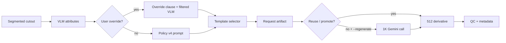

# Catalog generation (Nano Banana 2)

Gemini **Nano Banana 2** production pipeline: segmented garment image + template
(or derived geometry) + VLM attributes → generated catalog image.

**Production entry points:**

- `cloth-store-catalog-pipeline` — generate or reuse 12-case production outputs
- `cloth-store-catalog-final-packaging` — self-contained `final_catalog/` bundle

**Provider:** `google-genai` SDK, model `gemini-3.1-flash-image` (Nano Banana 2).

**Credentials:** `GEMINI_API_KEY` from the environment first; if unset, load from a
local dotenv file (`GEMINI_CREDENTIALS_FILE` override, then repo-external fallbacks).
Never commit credential files.

## Production pipeline flow

```text
1. Validate segmented cutout provenance + SHA-256
2. Load structured VLM garment attributes (local JSON or --vlm-attributes)
3. Apply optional user override JSON (precedence: override > VLM > template)
4. Deterministic template selection (confidence + review-required gate)
5. Build deterministic Gemini request artifact (identity + geometry + optional detail)
6. One native 1K API call OR exact-hash reuse / reference promotion
7. Deterministic local 512 LANCZOS derivative + non-generative QC + sanitized metadata
```



## CLI

```bash
uv sync --group dev --group gemini

# Dry-run: validate, build artifacts, cost/reuse plan — zero API calls
uv run cloth-store-catalog-pipeline --fixture outfit_6 --role top --dry-run
uv run cloth-store-catalog-pipeline --all-fixtures --dry-run

# Resume/reuse: default when production outputs match artifact hashes
uv run cloth-store-catalog-pipeline --fixture outfit_6 --role top

# Opt-in regeneration (billable — one call maximum, no automatic retries)
uv run cloth-store-catalog-pipeline --fixture outfit_6 --role top --regenerate
```

### Flags

| Flag | Behavior |
|------|----------|
| `--dry-run` | Full validation + artifact build + reuse/promotion plan; **no API** |
| default | Reuse production outputs or promote matching reference outputs |
| `--regenerate` | Explicit opt-in for one billable 1K call when outputs missing/stale |
| `--override PATH` | User correction JSON (default: `overrides/{fixture}_{role}.override.json`) |
| `--vlm-attributes PATH` | VLM extraction JSON (default: `vlm_attributes/{fixture}_{role}.attributes.json`) |

## Output contract

**Namespace:** `outputs/nano_banana_2/catalog_production_v1/{fixture}/`

| File | Description |
|------|-------------|
| `{role}_1k_raw.png` | Native 1K API output (canonical master) |
| `{role}.png` | Deterministic 512×512 LANCZOS derivative |
| `{role}.run.json` | Sanitized run metadata (no prompt text, no credentials) |

**Artifacts:** `artifacts/{fixture}_{role}_{template_id}.pipeline.request.json`,
`.geometry_reference.request.json`, or `.user_corrected.request.json` when overrides apply.

## Shared production modules

| Module | Role |
|--------|------|
| `catalog_paths.py` | Cutout/template path helpers |
| `catalog_vlm_records.py` | VLM attribute load/hash and prompt clauses |
| `catalog_request_overrides.py` | User-corrected request builder |
| `catalog_derived_geometry.py` | Derived geometry validation and prompts |
| `catalog_output_contract.py` | 1K output constants and validation |
| `catalog_pipeline.py` | Production orchestrator |
| `catalog_geometry_reference.py` | Geometry-reference override builder |

## Historical experiments removed

Dual-resolution matrix benchmarks, VLM-conditioned / presentation-matched /
user-corrected / geometry-candidate bench runners, Plan 2 reconstruction
(Flux, TEMU, template projection), and geometry preflight CLIs were removed
after production finalization (Aug 2026). Only `catalog_production_v1` outputs
and the production pipeline remain.

Repackage after production changes:

```bash
uv run cloth-store-catalog-final-packaging --repo-root .
```

Output: self-contained `final_catalog/` with per-case inputs, outputs, attributes,
metadata, contact sheet, and manifest for human review.

## References

- Model: [Gemini 3.1 Flash Image](https://ai.google.dev/gemini-api/docs/models/gemini-3.1-flash-image)
- Production code: `src/cloth_store/catalog_pipeline.py`, `catalog_user_override.py`
